# nobodyplace —— 一个 CSGO 饰品历史价格查询和库存管理中心

##  简介

作为一个计算机的卑微研究生，平时 gogo 里面也买了一些饰品，虽然比不上其他倒爷，但也是一笔大开销。

基于 csgo 饰品的特殊性，购买 != 永远持有，一个饰品可能会由于炒作/箱子下架等等因素导致价格增长，虽然我不追求低价买入、高价卖出，但是知道自己库存里面饰品的总体价格变化还是一件好事。

所以 nobodyplace 就诞生了。这是一个 CSGO 饰品历史价格查询和库存管理中心，包含所有真实的饰品信息（爬的）和支持动态获取最新价格（当然只有请求了才会去获取，而且没开会员只能拿最近一个月的，但是会存查询记录就是了）。当然做这个的还有一个目的就是练习 coding 水平了，嘻嘻。

## 技术总览

前端：Vue + Element UI + Nginx

后端：SpringBoot + MyBatis + Redis + Mysql

前端地址：https://github.com/nobodyyyyyy/nobodyplace-front

后端地址：https://github.com/nobodyyyyyy/nobodyplace-backend

## 特性支持

- 🏠 个性化的上网登录页，支持多种搜索引擎、搜索建议的切换
- 🏠📅 支持倒数日应用
- 🔍 CSGO 饰品分类、分页搜索
- 👛 CSGO 饰品入库
- 🔍📶⏰ CSGO 饰品实时价格曲线查询
- 🔍📶 CSGO 库存价格统计及更新
- 🏆 CSGO 库存排行榜
- ⏰ CSGO 每日“开盘”提醒

### 1. 上网登录页 

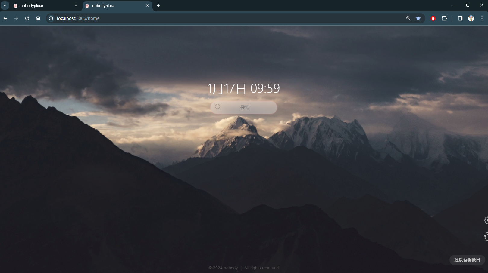

📅**右下角的倒数日**

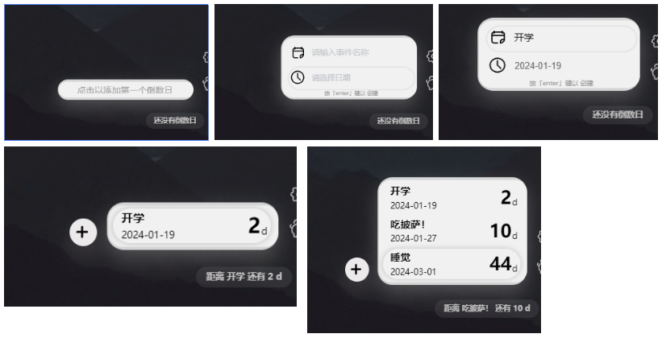

**🔍搜索引擎选择**

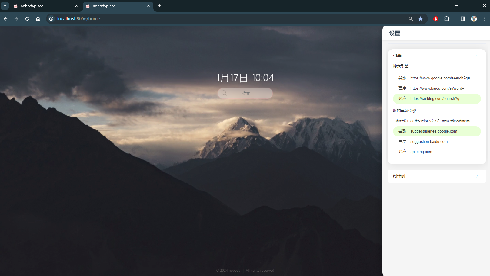

**🔍搜索引擎联想**

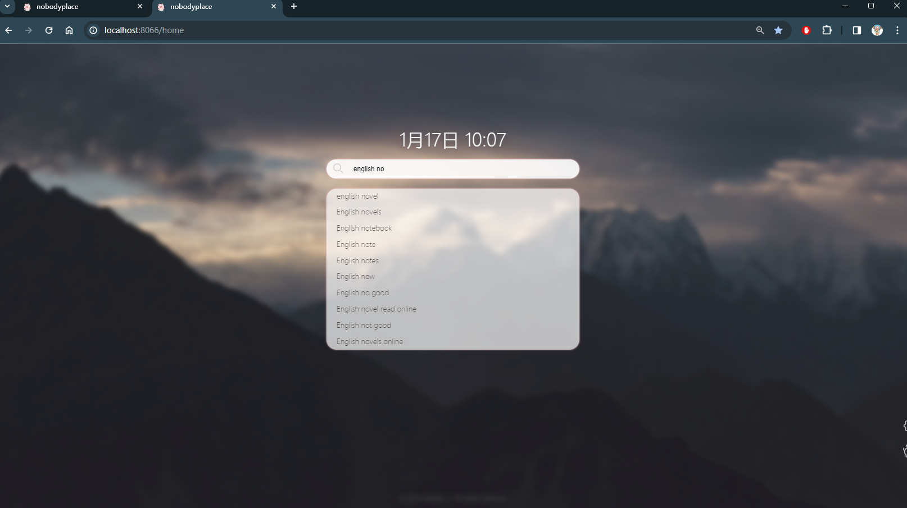

🚪**进入 CSGO 中心**

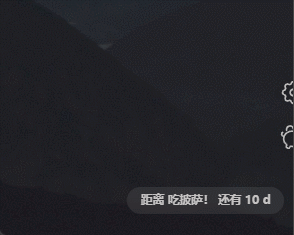

### 2. 饰品查询

🔍**CSGO饰品分页展示**

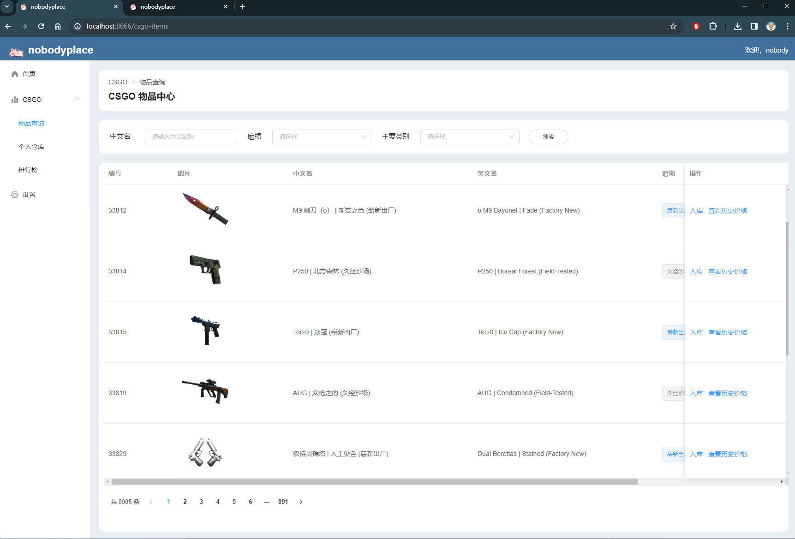

🔍**CSGO饰品分类搜索**

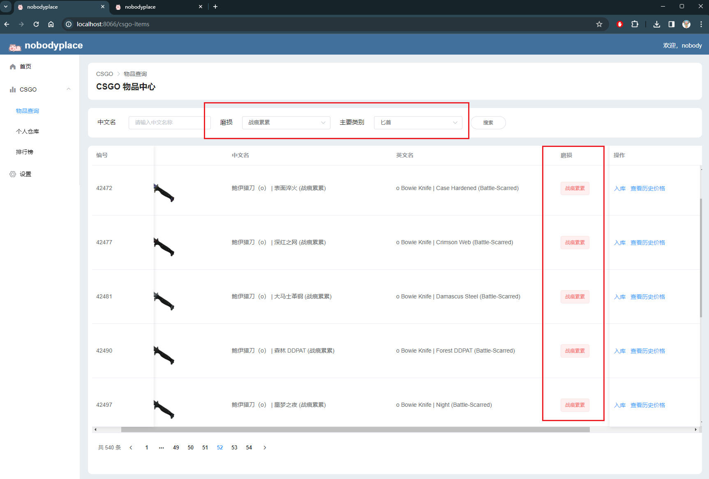

🔍**CSGO饰品查询**

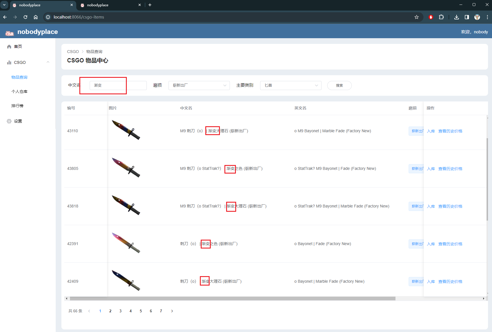

### 3. 饰品入库

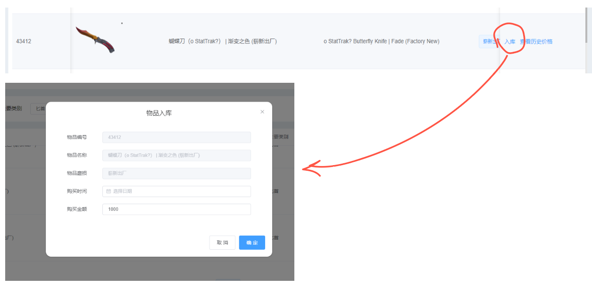

### 4. 饰品实时价格查询

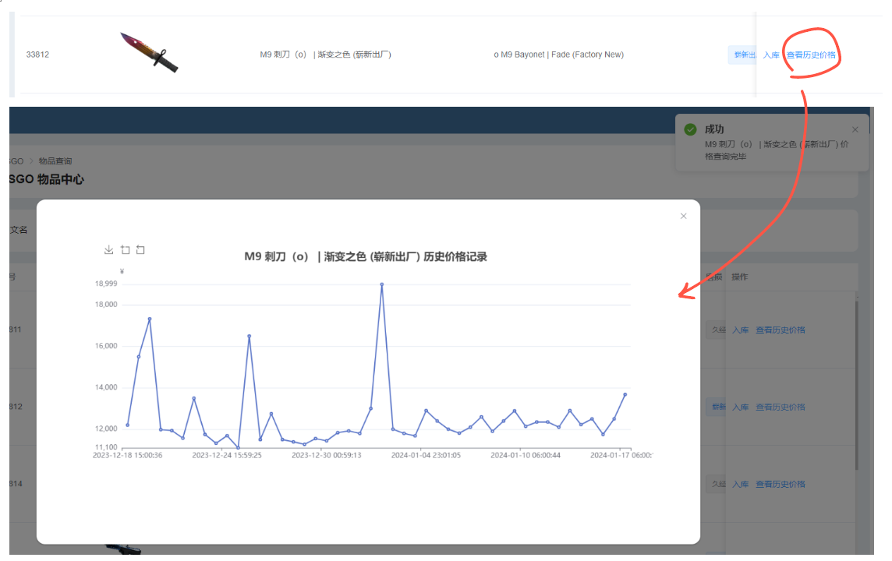

###  5. 库存价格统计及更新

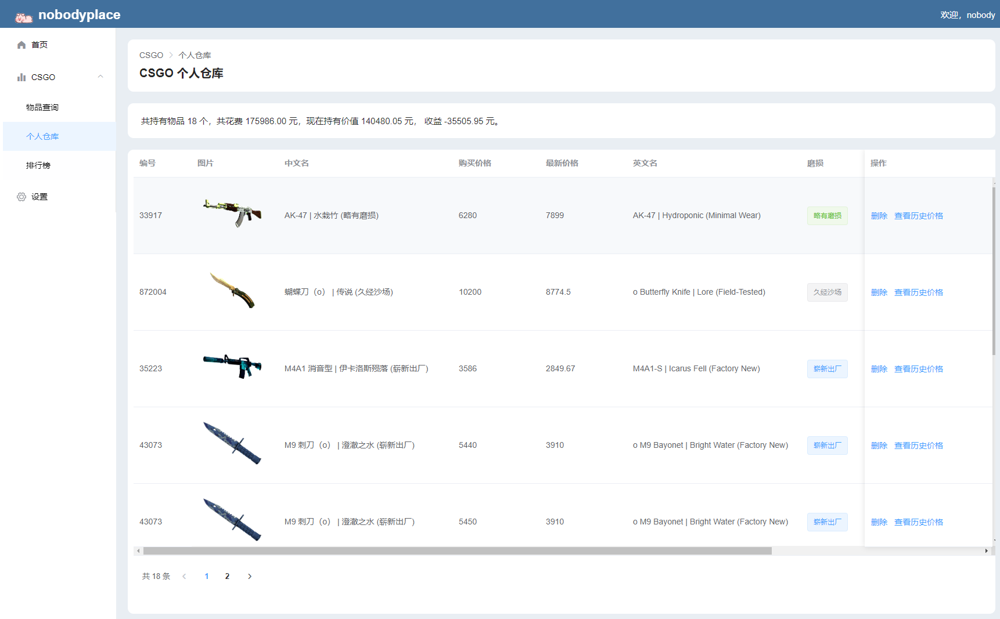

### 6.库存排行榜

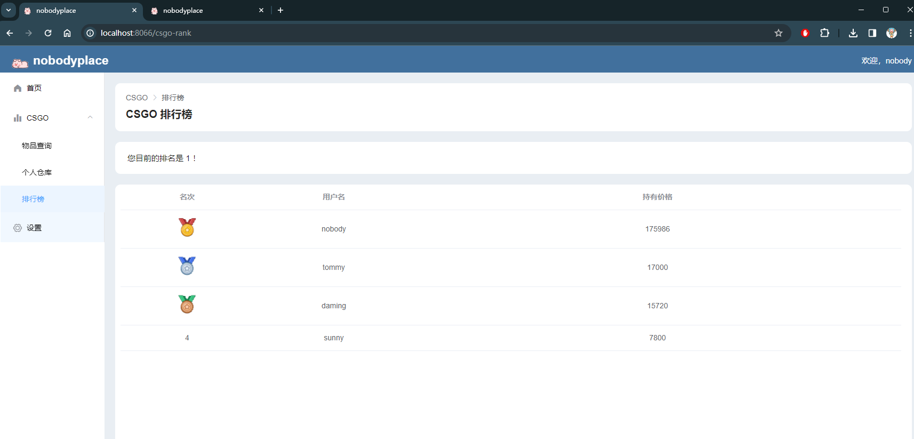

### 7. 每日“开盘”提醒

每天下午4点（夏令时则是3点）是当天交易解锁/刷新的时间，后端会通过连接的 session 做推送

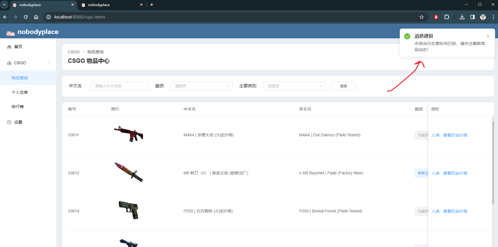
